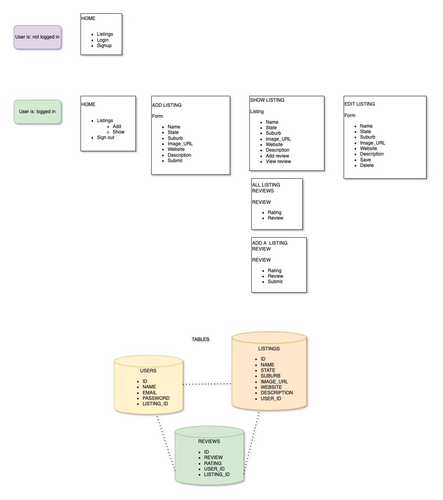

# beauty-app

# What is it?

You know how all of the best little-known, trusted-by-everyone, almost-magic beauty recommendations come from your aunty? Well, I created a CRUD app where users could share the best beauty businesses in Australia for black women. It's called Aunty.

# 👀 Wanna look?

Check out the live site [here](https://protected-caverns-00008.herokuapp.com/)

# 👩🏾‍💻 Tech used

-   HTML
-   CSS
-   Python
-   Postgres
-   Heroku

# ✅ Technical requirements

-   Semantically clean HTML and CSS
-   At least 2 tables
-   Sign up/log in functionality with encrypted passwords & an authorization flow
-   Ability for users to modify data in the database
-   Be deployed online and accessible to the public

# 🗣️ User stories

-   As a user I want to create listings so I can share my recommendations with the Aunty community
-   As a user I want to find cool hidden beauty spots so I can pamper myself and feel beautiful
-   As a user I want to add a review of a beauty spot I just tried to let others now how great my experience was
-   As a user I want the ability to edit or delete my account and reviews so I feel in control of my digital footprint

# 📋 Planning

# 💡 Next steps

-   I ran out of time to implement edit/delete functionality to user reviews, so this will be my next task!
-   My preference would also be to have most content gated behind a homepage login/signup, this will be addressed in the next iteration.
