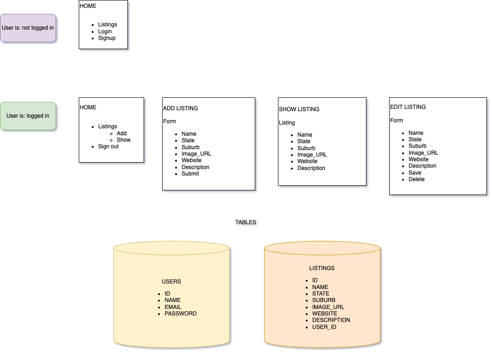

# beauty-app

# What is it?
You know how all of the best little-known, trusted-by-everyone, almost-magic beauty recommendations come from your aunty? Well, I created a CRUD app where users could share the best beauty businesses in Australia for black women. It's called Aunty.

# 👀 Wanna look?

Check out the live site [here](https://protected-caverns-00008.herokuapp.com/)

# 👩🏾‍💻 Tech used

-   HTML
-   CSS
-   Python
-   Postgres
-   Heroku

# ✅ Technical requirements

-   Semantically clean HTML and CSS
-   At least 2 tables
-   Sign up/log in functionality with encrypted passwords & an authorization flow
-   Ability for users to modify data in the database
-   Be deployed online and accessible to the public

# 🗣️ User stories

# ✍🏽 Mockups

# 📋 Planning

